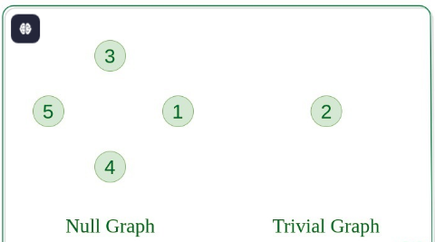
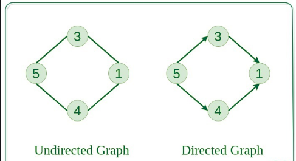
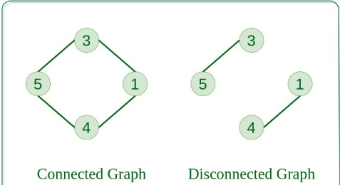
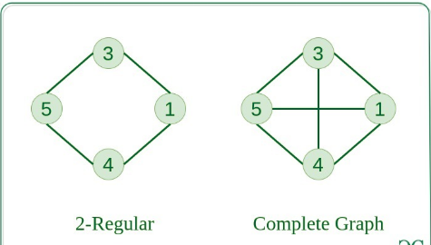
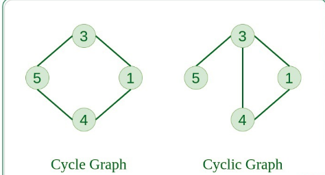
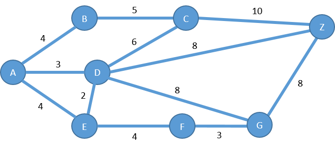
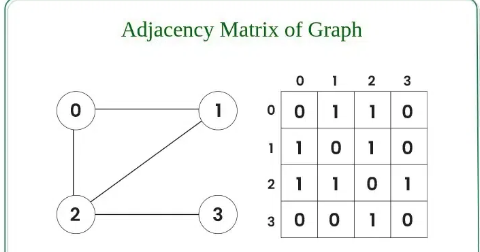

### **Null Graph**

*   **Definition:** A graph that has one or more vertices (nodes) but **no edges**.
    
*   **Application:** Represents entities that exist in a system but have no established relationships or connections, such as a set of newly registered, isolated users on a social media platform.
    

### **Trivial Graph**

*   **Definition:** The simplest possible graph, consisting of a **single vertex** and no edges.
    
*   **Application:** Primarily used as a base case in mathematical proofs and algorithms related to graph theory.

    

----

### **Undirected Graph**

*   **Definition:** A graph where the edges represent a **two-way relationship**. If vertex A is connected to vertex B, then B is also connected to A. The edge is identical to the edge .
    
*   **Application:** Modeling social networks like Facebook, where friendships are mutual. If you are friends with someone, they are also friends with you.
    

### **Directed Graph (Digraph)**

*   **Definition:** A graph where edges have a direction, representing a **one-way relationship**. An edge from vertex A to B does not imply an edge from B to A.
    
*   **Application:** Modeling the structure of the World Wide Web, where one webpage can link to another without the second page necessarily linking back.
    

----

### **Connected Graph**

*   **Definition:** An undirected graph where there is a **path between every pair of distinct vertices**. The entire graph is "in one piece."
    
*   **Application:** Representing a computer network where every device can communicate with every other device, either directly or through intermediate nodes.
    

### **Disconnected Graph**

*   **Definition:** An undirected graph that is not connected. It is made up of **two or more separate "components"** that are not connected to each other.
    
*   **Application:** Visualizing clusters in data, such as separate groups of friends in a larger social network who have no mutual connections between the groups.
    

----

### **Complete Graph**

*   **Definition:** A simple undirected graph in which **every pair of distinct vertices is connected by a unique edge**. A complete graph with vertices is denoted as .
    
*   **Application:** Modeling a network topology where every node must be directly connected to every other node, such as in a small, fully connected telecommunications network for maximum redundancy.
    

----

### **Cyclic Graph**

*   **Definition:** A graph that contains at least one **cycle**, which is a path that starts and ends at the same vertex without reusing edges.
    
*   **Application:** Detecting deadlocks in operating systems. A cycle in a resource allocation graph (where nodes are processes and resources) indicates that a set of processes are all waiting on each other, causing a deadlock.
    

### **Directed Acyclic Graph (DAG)**

*   **Definition:** A directed graph that contains **no directed cycles**. You can't start at a vertex, follow a path of directed edges, and return to the starting vertex.
    
*   **Application:** Scheduling tasks with dependencies, like in a software project. Each task is a vertex, and a directed edge from task A to B means A must be completed before B can start. The lack of cycles ensures the project can actually be completed.
    

### **Bipartite Graph**

*   **Definition:** A graph whose vertices can be divided into **two disjoint sets**, let's call them and , such that every edge connects a vertex in to one in . No edge connects two vertices within the same set.
    
*   **Application:** Used in matching problems, such as assigning jobs to applicants. One set of vertices represents the applicants and the other represents job openings; an edge indicates that an applicant is qualified for a particular job.
    

----

### **Weighted Graph**

*   **Definition:** A graph where each edge is assigned a **numerical value called a "weight"** or "cost." This weight can represent distance, time, capacity, or any other measurable quantity.
    
*   **Application:** GPS and mapping services like Google Maps. Cities are vertices, roads are edges, and the weights are the distance or estimated travel time between them. Algorithms like Dijkstra's use these weights to find the shortest or fastest route.

---

### **Graph Representation**
----
An adjacency matrix is a square matrix that represents a graph, where the matrix's size corresponds to the number of vertices in the graph, and each cell (i, j) indicates whether an edge exists between vertex 'i' and vertex 'j'. For unweighted graphs, a '1' denotes an edge and '0' denotes no edge, while for weighted graphs, the cell contains the weight of the edge or 0 if no edge exists. This representation is effective for dense graphs and allows for constant-time checking of adjacency between any two vertices.  How it Works

1.  **Size**: If a graph has 'n' vertices, its adjacency matrix will be an `'n x n'` matrix. 

2.  **Rows and Columns**: Each row and column of the matrix corresponds to a vertex in the graph. 

3.  **Edge Representation**:

    *   An entry at `A[i][j]` = 1 means there is an edge from vertex 'i' to vertex '`j'.` 

    *   An entry at `A[i][j]` = 0 means there is no edge between vertex 'i' and vertex 'j'. 

4.  **Weighted Graphs**: In a weighted graph, the entry A[i][j] can hold the weight of the edge connecting vertex 'i' and vertex 'j', rather than just a '1'. 

Key Properties

*   **Unweighted Graphs**: In a simple, unweighted graph, the matrix contains only 0s and 1s. 

*   **Undirected Graphs**: For an undirected graph, the adjacency matrix is symmetric, meaning `A[i][j] = A[j][i]` because edges are bidirectional. 

*   **Directed Graphs**: For a directed graph, the matrix is not necessarily symmetric, as an edge from 'i' to 'j' does not imply an edge from 'j' to 'i'. 

*   **Dense Graphs**: Adjacency matrices are well-suited for dense graphs (graphs with many edges) because their space requirement is fixed at `O(n²)`. 

*   **Adjacency Checking**: You can check if vertex 'i' and vertex 'j' are adjacent by simply checking the value of `A[i][j]` in constant time
----

