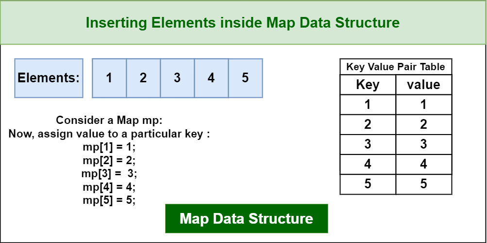
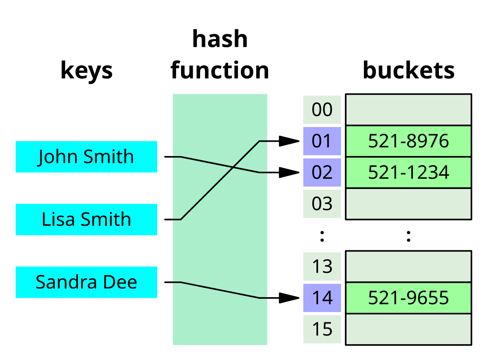
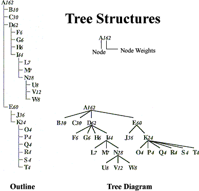
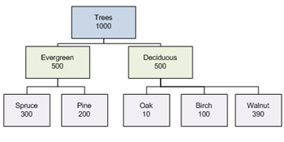
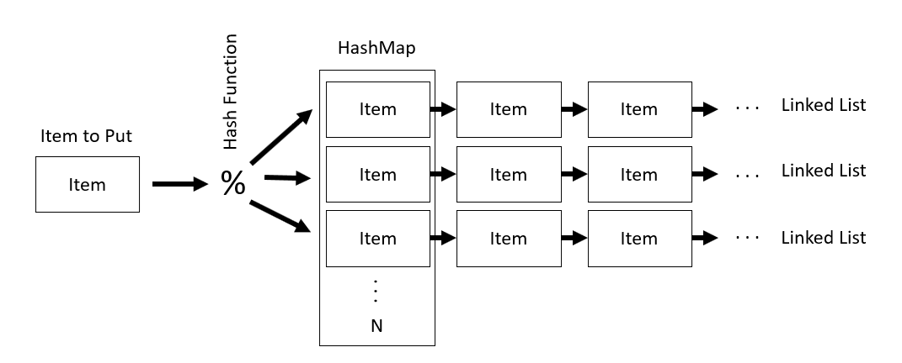

# Maps

A Map (also known as an associative array, dictionary, or symbol table) is an abstract data structure that stores a collection of key-value pairs. Each key in a map must be unique, and it is used to store and retrieve its corresponding value.

Think of it as a real-world dictionary:

Key: The word you look up (e.g., "computer").

Value: The definition of that word (e.g., "an electronic device for storing and processing data...").

---

## **HashTables/HashMaps**

A HashTable is the most common implementation of a map. It uses a special function, called a hash function, to compute an index (or "slot") in an array for a given key. The value is then stored at that index.

Structural Info:

### **Array**: 
The core is an array of "buckets" or "slots."

## **Hash Function**:
A function that takes a key and converts it into an integer that corresponds to an index in the array.

## **Collisions:**
When two different keys hash to the same index, it's called a collision. This is a normal and expected event. The two most common ways to handle it are:

## **Separate Chaining:**
Each array bucket holds a pointer to another data structure (often a linked list) that stores all the key-value pairs that hashed to that same index.

## **Open Addressing:**
If a bucket is full, the new key-value pair is stored in the next available bucket according to a specific "probing" rule.

## **Applications:**

- Dictionaries: The primary data structure used for dictionaries in languages like Python (dict), Java (HashMap), and C++ (std::unordered_map).

- Caching: Used to create high-speed lookup tables for data that is expensive to compute, such as in web servers or databases.

- Database Indexing: Helps databases quickly find data records without scanning the entire table.

## **Key Features:**
Unbeatable average-case speed. Lookups, insertions, and deletions are typically O(1) (constant time), meaning the time they take is independent of the map's size. However, it does not maintain any order.

---

---

## **TreeMaps**

A TreeMap is an implementation of a map that keeps its keys in sorted order.

Structural Info:

Self-Balancing Binary Search Tree (BST): It is almost always implemented using a self-balancing BST, such as a Red-Black Tree.

Node Storage: Each node in the tree holds a key-value pair, as well as pointers to its parent and left/right child nodes.

Balancing: The "self-balancing" nature (like a Red-Black Tree) ensures that the tree remains balanced as items are added or removed. This guarantees that operations remain efficient.

Applications:

Sorted Dictionaries: Any time you need to store data and also iterate over it in sorted key order (e.g., a leaderboard, a phone book).

Range Queries: Excellent for finding all items with keys in a specific range (e.g., "find all employees hired between 2020 and 2022").

Data Visualization: Can be used to store data that needs to be displayed in a sorted or hierarchical fashion.

Key Feature: Keys are always sorted. Lookups, insertions, and deletions are guaranteed to be O(log n) (logarithmic time). This is slightly slower than a HashTable's O(1) average, but it's very consistent, and it provides the crucial feature of ordering.

---

---

## **LinkedList Maps aka Association Maps**

This is the simplest, but least efficient, way to implement a map. It's often called an Association List.

Structural Info:

Linked List: It is simply a linked list where each node contains a key-value pair.

Simple Node: Each node just holds (key, value, next_pointer).

Operations:

Insertion: To add a new pair, you simply add a new node to the front of the list. This is very fast: O(1).

Lookup: To find a value, you must start at the head of the list and traverse it one node at a time, checking each key until you find a match. In the worst case, you have to check the entire list. This is very slow: O(n) (linear time).

Applications:

Internal Compiler/Interpreter Use: Used in some programming languages (like Lisp) for managing variable scopes, where new variables are frequently added and the total number of variables in a single scope is small.

Hash Table Collisions: As mentioned earlier, linked lists are often the data structure used inside a HashTable bucket to handle collisions (this is the "separate chaining" method).

Key Feature: Extremely simple to implement, but only practical for very small maps where the number of items (n) is tiny, or when insertions must be as fast as possible and lookups are rare.

---
